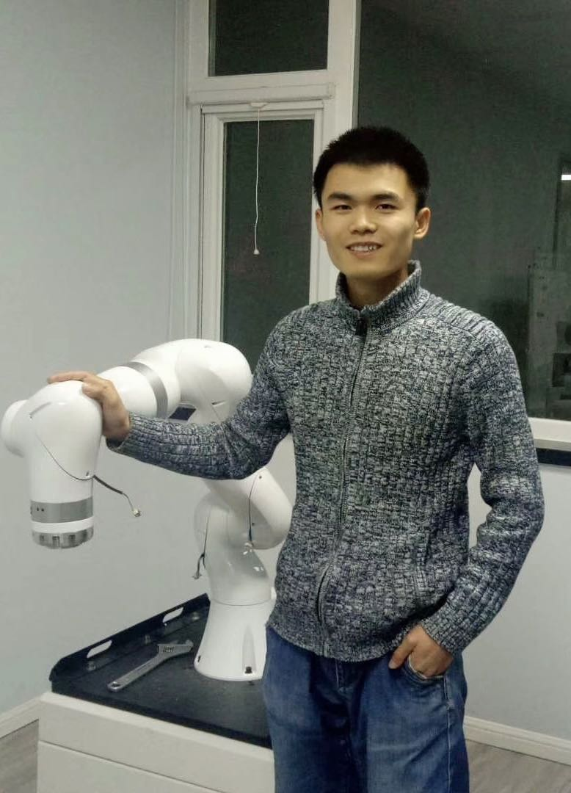

## Welcome to my home page!

 

Hi there! I'm currently a research engineer at [Shenzhen Institute of Artificial Intelligence and Robotics for Society]  \([AIRS]\), mainly participating in the *Multi-Agent Collaborative Manipulation* strand of [UoE-AIRS Joint Project].

Previously, after receiving my B.Sc and M.Eng degrees both from Beihang University, I have ever worked in industry and developed [an advanced collaborative robot] with torque sensors on each joint as a core member. Afterwards, I went to Hong Kong and worked as a research assistant with Dr. Peng Lu and Dr. Jia Pan successively.

I am interested in applying advanced control techniques to robots that are safer with the environment and more collaborative with humans. Now, I am mainly working on developing adaptive control algorithm for human-robot collaboration to improve the working efficiency in manufacturingfactories.

#### Education

- [Beihang University], 2014-2017
  - M.Eng in *Flight Dynamics & Control*
  - Excellent Graduate Student Award (10%)
- [Beihang University], 2010-2014
  - B.Sc in *Aircraft Design & Engineering*
  - Excellent Student Award (10%)

#### Experience

- Research Engineer, [AIRS], 2020.10-present
- Research Assistant, [PolyU] & [HKU], 2019.01-2020.07
- Robotics Algorithm Engineer, [ROKAE], 2017.05-2018.11

#### Skills

* C/C++, Python, Matlab/Simulink/Simscape, Linux, Git
* ROS/Gazebo, OROCOS, Pybullet
* Hands-on experiences on MAVs, manipulators and mobile-manipulators
* Theory of kinematics, dynamics, control and identification in Robotics & Aeronautics.

[BUAA]: https://ev.buaa.edu.cn/
[Beihang University]: https://ev.buaa.edu.cn/
[an advanced collaborative robot]: https://www.rokae.com/product1
[UoE-AIRS Joint Project]: https://web.inf.ed.ac.uk/slmc/research/projects-and-grants/uoe-airs-joint-project
[HKU]: https://www.hku.hk/
[PolyU]: https://www.polyu.edu.hk/en/
[ROKAE]: https://www.rokae.com/?l=en-us
[Shenzhen Institute of Artificial Intelligence and Robotics for Society]: https://airs.cuhk.edu.cn/en/
[AIRS]: https://airs.cuhk.edu.cn/en/
