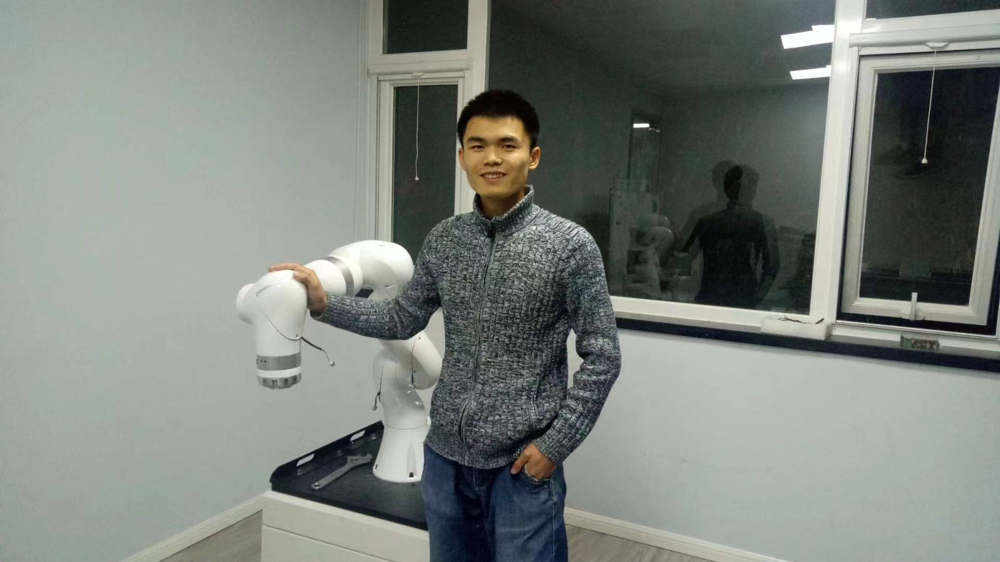

## Welcome to my home page!

 

*Hi there!* I'm currently a research engineer at [Shenzhen Institute of Artificial Intelligence and Robotics for Society]  \([AIRS]\), mainly working on the *Multi-Agent Collaborative Manipulation* strand of [UoE-AIRS Joint Project].

Previously, after receiving my B.Sc and M.Eng degrees both from [Beihang University], I joined a robotics start-up in Beijing as a robotics algorithm engineer, where, as a core member, I participated in the development of [an advanced collaborative robot] with torque sensors on each joint. Afterwards, I went to Hong Kong and worked as a research assistant with Dr. Peng Lu and Dr. Jia Pan successively.

I am interested in applying advanced control technologies to robots so that they can not only interact safely and robustly with the environment under various uncertainties, but also be more collaborative with humans. Now, I am mainly working on developing adaptive control on mobile-manipulators for efficient human-robot collaboration to improve the working efficiency in factories.

#### Education

- 2014 - 2017,  **M.Eng**,  [Beihang University], GPA 3.84/4.0
  - *Flight Dynamics & Control*
  - Outstanding Graduate Student Award (top 10%)
- 2010 - 2014,  **B.Sc**,  [Beihang University], GPA 3.70/4.0
  - *Aeronautical Engineering*
  - Outstanding Student Award (top 10%)

#### Experience

- 10/2020 - present, Research Engineer,  [AIRS]
- 01/2019 - 07/2020, Research Assistant,  [PolyU] & [HKU]
- 05/2017 - 11/2018, Robotics Algorithm Engineer,  [ROKAE]

#### Skills

* C/C++, Python, Matlab/Simulink/Simscape, Linux, Git
* ROS/Gazebo, OROCOS/RTT, Pybullet
* Hands-on experiences on various types of robots including MAV, manipulator and mobile robot
* Theory of kinematics, dynamics, control and identification in Robotics & Aeronautics.

[BUAA]: https://ev.buaa.edu.cn/
[Beihang University]: https://ev.buaa.edu.cn/
[an advanced collaborative robot]: https://www.rokae.com/product1
[UoE-AIRS Joint Project]: https://web.inf.ed.ac.uk/slmc/research/projects-and-grants/uoe-airs-joint-project
[HKU]: https://www.hku.hk/
[PolyU]: https://www.polyu.edu.hk/en/
[ROKAE]: https://www.rokae.com/?l=en-us
[Shenzhen Institute of Artificial Intelligence and Robotics for Society]: https://airs.cuhk.edu.cn/en/
[AIRS]: https://airs.cuhk.edu.cn/en/
